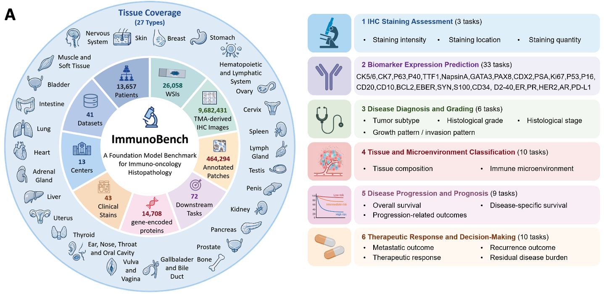
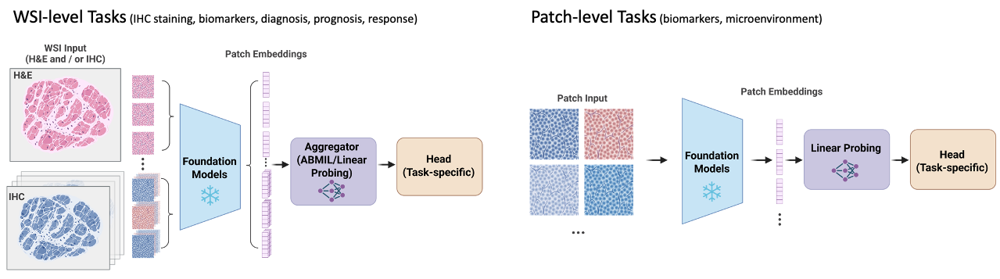
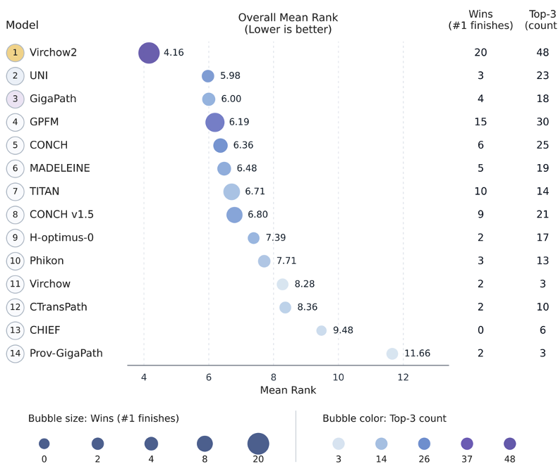
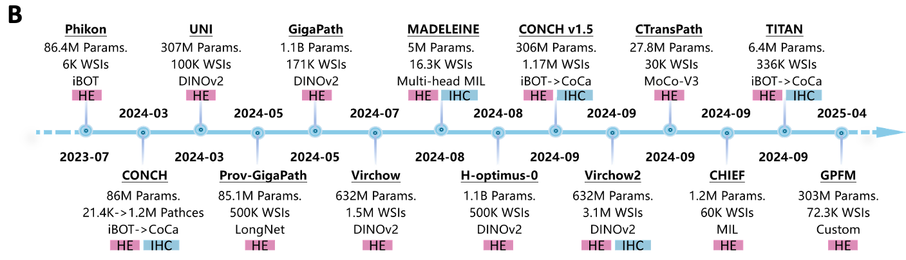

# ImmunoBench maps the performance landscape of pathology foundation models in immunohistochemistry-centered precision oncology

\[ [Paper (Coming Soon)]() | [Features on HuggingFace](https://huggingface.co/datasets/AI4Pathology/ImmunoBench-image-features) | [Leaderboard](https://yanfang-research.github.io/ImmunoBench-Web/) \]

<p align="center">
  
</p>

## Overview

> **ABSTRACT**
>
> *Immunohistochemistry (IHC) provides spatially resolved protein-expression information that links tissue morphology to molecular phenotype and supports tumour classification, biomarker assessment, prognostic stratification and therapeutic decision-making. While pathology foundation models (PFMs) have shown strong transferability in hematoxylin and eosin (H&E)-based tasks, their ability to encode IHC-derived molecular and functional signals remains insufficiently evaluated. Here we introduce ImmunoBench, a large-scale, multi-institutional benchmark for evaluating PFMs in IHC-centered pathology workflows. ImmunoBench integrates data from 13,657 patients, 26,058 whole-slide images (WSIs), 9,682,431 TMA-derived IHC images and 464,294 annotated patches, collected across 13 institutions, covering 27 organs, 43 clinical stains and 14,708 gene-encoded proteins. We evaluate 14 representative PFMs across 71 clinically relevant endpoints, including IHC staining assessment, biomarker prediction, disease diagnosis and grading, tissue microenvironment classification, prognosis and treatment response prediction, with IHC-only, H&E-only, multi-stain and external validation settings.*
>
> *Across tasks, PFMs performed strongly on local morphology and spatially coherent staining signals, including staining localization, tissue microenvironment classification, lineage markers and breast-specific biomarkers, but showed lower and more variable performance on sparse, heterogeneous and outcome-related endpoints such as vascular markers, PD-L1, prognosis and treatment response. Patch-level models generally outperformed WSI-level models in local IHC recognition tasks, whereas neither paradigm achieved robust performance on prognosis or treatment-response endpoints. IHC-aware and multimodal pretraining provided selective rather than universal benefits, and external validation revealed marker-dependent cross-center degradation. Together, ImmunoBench delineates current PFM capabilities and limitations in molecularly informative pathology and provides an open ecosystem with curated datasets, standardized protocols, pre-extracted embeddings and a dynamic leaderboard for reproducible model development.*

## Installation

```bash
git clone https://github.com/YOUR_USERNAME/immune_bench.git
cd immune_bench
conda create -n immunobench python=3.9
conda activate immunobench
pip install -r requirements.txt
```

## Dataset

Features are hosted on HuggingFace:
- Dataset: [AI4Pathology/ImmunoBench-image-features](https://huggingface.co/datasets/AI4Pathology/ImmunoBench-image-features)

If you do not want to use the pre-extracted features provided here, you can extract features from whole-slide images yourself with [CLAM](https://github.com/mahmoodlab/CLAM).

Top-level folders are organized by task:

```text
ImmunoBench-image-features/
├── HANCOCK_Chemotherapy_DSS/
├── HANCOCK_Chemotherapy_OS/
├── HANCOCK_Chemotherapy_Recurrence/
├── HANCOCK_Radiotherapy_DSS/
├── HANCOCK_Radiotherapy_OS/
├── HANCOCK_Radiotherapy_Recurrence/
├── HANCOCK_Surgery_DSS/
├── HANCOCK_Surgery_OS/
└── HANCOCK_Surgery_Recurrence/
```

Each task contains three modality folders:
- `HE_Only`: H&E features only
- `IHCs_Only`: IHC features only
- `Multi_Stain`: concatenated H&E and IHC features

Within each modality, features are grouped by backbone, for example `virchow`, `virchow2`, `gigapath_wsi`, `uni`, and `conch`.

### CSV and Modality Mapping

The repository already includes CSV files and training scripts for all three modality settings:

| CSV suffix | Modality | HuggingFace folder | Script suffix |
| --- | --- | --- | --- |
| none | Multi-stain | `Multi_Stain/` | none |
| `_HE` | H&E only | `HE_Only/` | `_HE` |
| `_IHC` | IHC only | `IHCs_Only/` | `_IHC` |

Examples:
- `HANCOCK_Chemotherapy_OS_survival.csv` -> `Multi_Stain/` -> `survival_HANCOCK_Chemotherapy_OS.sh`
- `HANCOCK_Chemotherapy_OS_survival_HE.csv` -> `HE_Only/` -> `survival_HANCOCK_Chemotherapy_OS_HE.sh`
- `HANCOCK_Chemotherapy_OS_survival_IHC.csv` -> `IHCs_Only/` -> `survival_HANCOCK_Chemotherapy_OS_IHC.sh`

## Task Categories

ImmunoBench covers six task categories. Users should prepare data and run the corresponding scripts step by step.

<p align="left">
  
</p>

### 1. Immunohistochemical Staining Assessment
   
   `HPA10M_staining_intensity`
   
   `dataset_csv/HPA10M_staining_intensity.csv`
   
   `train_scripts/subtype_HPA10M_staining_intensity.sh`
   
   `HPA10M_staining_intensity.csv` is not distributed directly in this repository because of file size limits. A download link will be provided here later (for example, Google Drive).
   
   **Note**: Due to the large dataset size, you need to create splits using `create_splits_seq` before training.
   
   **Example**:
   ```bash
   python create_splits_seq.py --test_frac 0.2 --prefix splits712 --k 1 --task HPA10M_staining_intensity --seed 42
   bash train_scripts/subtype_HPA10M_staining_intensity.sh
   ```

### 2. Immunohistochemical Biomarker Expression
   
   `GATA3_pancancer`
   
   `dataset_csv/GATA3_pancancer_subtyping.csv`
   
   `train_scripts/subtype_GATA3_pancancer.sh`
   
   **Example**:
   ```bash
   python create_splits_seq.py --test_frac 0.2 --prefix splits712 --k 5 --task GATA3_pancancer --seed 1024
   bash train_scripts/subtype_GATA3_pancancer.sh
   ```

### 3. Disease Diagnosis and Grading
   
   `HANCOCK_grading`
   
   **Example**:
   ```bash
   bash train_scripts/subtype_HANCOCK_grading.sh
   bash train_scripts/subtype_HANCOCK_grading_HE.sh
   bash train_scripts/subtype_HANCOCK_grading_IHC.sh
   ```

### 4. Tissue and Tumor Microenvironment Classification
   
   `HNSCC_mIF_mIHC_CD8`
   
   **Example**:
   ```bash
   bash train_scripts/patch_HNSCC_mIF_mIHC_CD8.sh
   ```

### 5. Disease Progression and Prognosis
   
   `DLBCL_Morph`
   
   **Example**:
   ```bash
   bash train_scripts/survival_DLBCL_Morph.sh
   ```

### 6. Therapeutic Response and Decision-Making
   
   `HANCOCK_Chemotherapy_Recurrence`
   
   **Example**:
   ```bash
   bash train_scripts/subtype_HANCOCK_Chemotherapy_Recurrence.sh
   bash train_scripts/subtype_HANCOCK_Chemotherapy_Recurrence_HE.sh
   bash train_scripts/subtype_HANCOCK_Chemotherapy_Recurrence_IHC.sh
   ```

Most tasks write results under `results/experiments/train/splits712/`. The patch-level tissue and tumor microenvironment classification task writes results under `results/experiments/train/patch/`. Logs are written under `logs/`.

## Training Notes

- Survival tasks use scripts named `survival_*.sh`
- Subtype tasks use scripts named `subtype_*.sh`
- Most settings can be changed by editing variables at the top of each script

Common customizations:

```bash
backbones="chief conch conch_v1_5 ctranspath gigapath GPFM phikon uni h_optimus_0 virchow virchow2 chief_wsi titan_wsi gigapath_wsi madeleine_wsi"
CUDA_VISIBLE_DEVICES=1 bash survival_HANCOCK_Chemotherapy_OS.sh
```

## Leaderboard

🏆 [ImmunoBench Leaderboard](https://yanfang-research.github.io/ImmunoBench/)

The public leaderboard provides an interactive benchmark snapshot, full task explorer, and overall model rankings.

<p align="left">
  
</p>

- Foundation models: `14`
- Clinical cohorts: `41`
- Whole-slide images: `9.7M+`
- Patients: `17k+`

### Classification Snapshot

Macro-averaged AUC ranking from the public leaderboard:

| Rank | Foundation model | Macro-averaged AUC |
| --- | --- | --- |
| 1 | `Virchow2` | `0.876` |
| 2 | `CONCH v1.5` | `0.869` |
| 3 | `GPFM` | `0.869` |
| 4 | `CONCH` | `0.869` |
| 5 | `UNI` | `0.868` |
| 6 | `GigaPath` | `0.866` |
| 7 | `Phikon` | `0.862` |
| 8 | `H-optimus-0` | `0.857` |
| 9 | `CTransPath` | `0.854` |
| 10 | `Virchow` | `0.851` |
| 11 | `MADELEINE` | `0.820` |
| 12 | `TITAN` | `0.819` |
| 13 | `CHIEF` | `0.800` |
| 14 | `Prov-GigaPath` | `0.745` |

### Prognosis Snapshot

Macro-averaged C-index ranking from the public leaderboard:

| Rank | Foundation model | Macro-averaged C-index |
| --- | --- | --- |
| 1 | `GigaPath` | `0.545` |
| 2 | `Phikon` | `0.542` |
| 3 | `UNI` | `0.534` |
| 4 | `GPFM` | `0.531` |
| 5 | `TITAN` | `0.530` |
| 6 | `Virchow2` | `0.528` |
| 7 | `MADELEINE` | `0.526` |
| 8 | `CHIEF` | `0.525` |
| 9 | `H-optimus-0` | `0.517` |
| 10 | `Prov-GigaPath` | `0.513` |
| 11 | `CONCH` | `0.509` |
| 12 | `CTransPath` | `0.507` |
| 13 | `CONCH v1.5` | `0.506` |
| 14 | `Virchow` | `0.505` |


## Available Backbones

<p align="center">
  
</p>

ImmunoBench includes features from the following pathology foundation models:
- CHIEF: [https://github.com/hms-dbmi/CHIEF](https://github.com/hms-dbmi/CHIEF)
- CONCH: [https://huggingface.co/MahmoodLab/CONCH](https://huggingface.co/MahmoodLab/CONCH)
- CONCH v1.5: [https://huggingface.co/MahmoodLab/TITAN](https://huggingface.co/MahmoodLab/TITAN)
- CTransPath: [https://github.com/Xiyue-Wang/TransPath](https://github.com/Xiyue-Wang/TransPath)
- Prov-GigaPath: [https://huggingface.co/prov-gigapath/prov-gigapath](https://huggingface.co/prov-gigapath/prov-gigapath)
- GPFM: [https://huggingface.co/majiabo/GPFM](https://huggingface.co/majiabo/GPFM)
- H-Optimus-0: [https://huggingface.co/bioptimus/H-optimus-0](https://huggingface.co/bioptimus/H-optimus-0)
- MADELEINE: [https://huggingface.co/MahmoodLab/madeleine](https://huggingface.co/MahmoodLab/madeleine)
- Phikon: [https://huggingface.co/owkin/phikon](https://huggingface.co/owkin/phikon)
- TITAN: [https://huggingface.co/MahmoodLab/TITAN](https://huggingface.co/MahmoodLab/TITAN)
- UNI: [https://huggingface.co/MahmoodLab/UNI](https://huggingface.co/MahmoodLab/UNI)
- Virchow: [https://huggingface.co/paige-ai/Virchow](https://huggingface.co/paige-ai/Virchow)
- Virchow2: [https://huggingface.co/paige-ai/Virchow2](https://huggingface.co/paige-ai/Virchow2)
