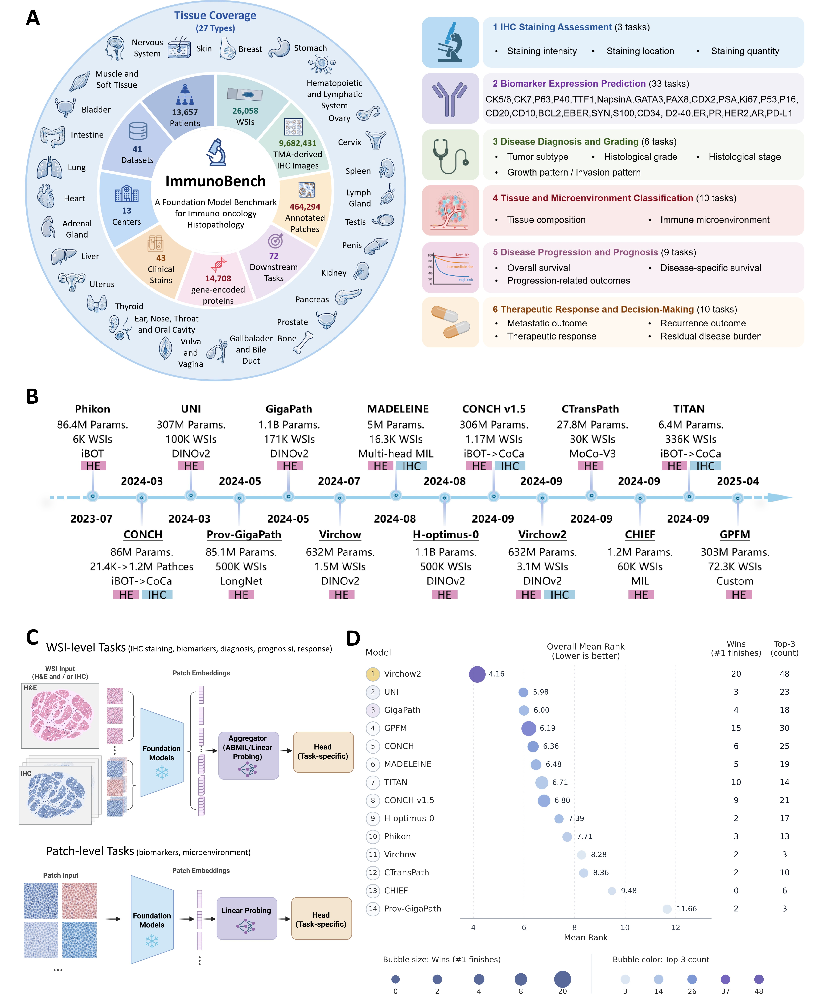

# ImmunoBench: A Benchmark for Immunohistochemistry-based Prediction Tasks

\[ [Paper (Coming Soon)]() | [Features on HuggingFace](https://huggingface.co/datasets/AI4Pathology/ImmunoBench-image-features) \]

Official repository for **ImmunoBench**, a benchmark for evaluating pathology foundation models on immunohistochemistry (IHC)-based clinical prediction tasks.

<p align="center">
  
</p>

## Overview

ImmunoBench provides:
- Pre-extracted features from pathology foundation models
- Multiple clinical prediction tasks, including survival and recurrence
- Three input settings: `HE_Only`, `IHCs_Only`, and `Multi_Stain`
- Training scripts and CSV files for direct benchmarking

## Installation

```bash
git clone https://github.com/YOUR_USERNAME/immune_bench.git
cd immune_bench
conda create -n immunobench python=3.9
conda activate immunobench
pip install -r requirements.txt
```

## Dataset

Features are hosted on HuggingFace:
- Dataset: [AI4Pathology/ImmunoBench-image-features](https://huggingface.co/datasets/AI4Pathology/ImmunoBench-image-features)

Top-level folders are organized by task:

```text
ImmunoBench-image-features/
├── HANCOCK_Chemotherapy_DSS/
├── HANCOCK_Chemotherapy_OS/
├── HANCOCK_Chemotherapy_Recurrence/
├── HANCOCK_Radiotherapy_DSS/
├── HANCOCK_Radiotherapy_OS/
├── HANCOCK_Radiotherapy_Recurrence/
├── HANCOCK_Surgery_DSS/
├── HANCOCK_Surgery_OS/
└── HANCOCK_Surgery_Recurrence/
```

Each task contains three modality folders:
- `HE_Only`: H&E features only
- `IHCs_Only`: IHC features only
- `Multi_Stain`: combined H&E and IHC features

Within each modality, features are grouped by backbone, for example `virchow`, `virchow2`, `gigapath_wsi`, `uni`, and `conch`.

### CSV and Modality Mapping

The repository already includes CSV files and training scripts for all three modality settings:

| CSV suffix | Modality | HuggingFace folder | Script suffix |
| --- | --- | --- | --- |
| none | Multi-stain | `Multi_Stain/` | none |
| `_HE` | H&E only | `HE_Only/` | `_HE` |
| `_IHC` | IHC only | `IHCs_Only/` | `_IHC` |

Examples:
- `HANCOCK_Chemotherapy_OS_survival.csv` -> `Multi_Stain/` -> `survival_HANCOCK_Chemotherapy_OS.sh`
- `HANCOCK_Chemotherapy_OS_survival_HE.csv` -> `HE_Only/` -> `survival_HANCOCK_Chemotherapy_OS_HE.sh`
- `HANCOCK_Chemotherapy_OS_survival_IHC.csv` -> `IHCs_Only/` -> `survival_HANCOCK_Chemotherapy_OS_IHC.sh`

## Task Categories

ImmunoBench covers six task categories. Users should prepare data and run the corresponding scripts step by step.

### 1. Immunohistochemical Staining Assessment
   
   `HPA10M_staining_intensity`
   
   `dataset_csv/HPA10M_staining_intensity.csv`
   
   `train_scripts/subtype_HPA10M_staining_intensity.sh`
   
   `HPA10M_staining_intensity.csv` is not distributed directly in this repository because of file size limits. A download link will be provided here later (for example, Google Drive).
   
   **Note**: Due to the large dataset size, you need to create splits using `create_splits_seq` before training.
   
   **Example**:
   ```bash
   python create_splits_seq.py --test_frac 0.2 --prefix splits712 --k 1 --task HPA10M_staining_intensity --seed 42
   bash train_scripts/subtype_HPA10M_staining_intensity.sh
   ```

### 2. Immunohistochemical Biomarker Expression
   
   `GATA3_pancancer`
   
   `dataset_csv/GATA3_pancancer_subtyping.csv`
   
   `train_scripts/subtype_GATA3_pancancer.sh`
   
   **Example**:
   ```bash
   python create_splits_seq.py --test_frac 0.2 --prefix splits712 --k 5 --task GATA3_pancancer --seed 1024
   bash train_scripts/subtype_GATA3_pancancer.sh
   ```

### 3. Disease Diagnosis and Grading
   
   `HANCOCK_grading`
   
   `dataset_csv/HANCOCK_grading_subtyping.csv`
   
   `dataset_csv/HANCOCK_grading_subtyping_HE.csv`
   
   `dataset_csv/HANCOCK_grading_subtyping_IHC.csv`
   
   `train_scripts/subtype_HANCOCK_grading.sh`
   
   `train_scripts/subtype_HANCOCK_grading_HE.sh`
   
   `train_scripts/subtype_HANCOCK_grading_IHC.sh`

### 4. Disease Progression and Prognosis
   
   `DLBCL_Morph`
   
   `dataset_csv/DLBCL_Morph_survival.csv`
   
   `train_scripts/survival_DLBCL_Morph.sh`

### 5. Therapeutic Response and Decision-Making
   
   `HANCOCK_Chemotherapy_Recurrence`
   
   `dataset_csv/HANCOCK_Chemotherapy_Recurrence_subtyping.csv`
   
   `dataset_csv/HANCOCK_Chemotherapy_Recurrence_subtyping_HE.csv`
   
   `dataset_csv/HANCOCK_Chemotherapy_Recurrence_subtyping_IHC.csv`
   
   `train_scripts/subtype_HANCOCK_Chemotherapy_Recurrence.sh`
   
   `train_scripts/subtype_HANCOCK_Chemotherapy_Recurrence_HE.sh`
   
   `train_scripts/subtype_HANCOCK_Chemotherapy_Recurrence_IHC.sh`

### 6. Tissue and Tumor Microenvironment Classification
   
   `HNSCC_mIF_mIHC_CD8`
   
   `train_scripts/patch_HNSCC_mIF_mIHC_CD8.sh`

For tasks 1 to 5, results are written under `results/experiments/train/splits712/`. For task 6, results are written under `results/experiments/train/patch/`. Logs are written under `logs/`.

## Training Notes

- Survival tasks use scripts named `survival_*.sh`
- Subtype tasks use scripts named `subtype_*.sh`
- Most settings can be changed by editing variables at the top of each script

Common customizations:

```bash
backbones="chief conch conch_v1_5 ctranspath gigapath GPFM phikon uni h_optimus_0 virchow virchow2 chief_wsi titan_wsi gigapath_wsi madeleine_wsi"
CUDA_VISIBLE_DEVICES=1 bash survival_HANCOCK_Chemotherapy_OS.sh
```

## Available Backbones

ImmunoBench includes features from the following pathology foundation models:
- `chief` `chief_wsi` `conch` `conch_v1_5` `ctranspath` `gigapath` `gigapath_wsi` `GPFM` `h_optimus_0` `madeleine_wsi` `phikon` `titan_wsi` `uni` `virchow` `virchow2`

## License

This project is released under the license provided with the repository.
